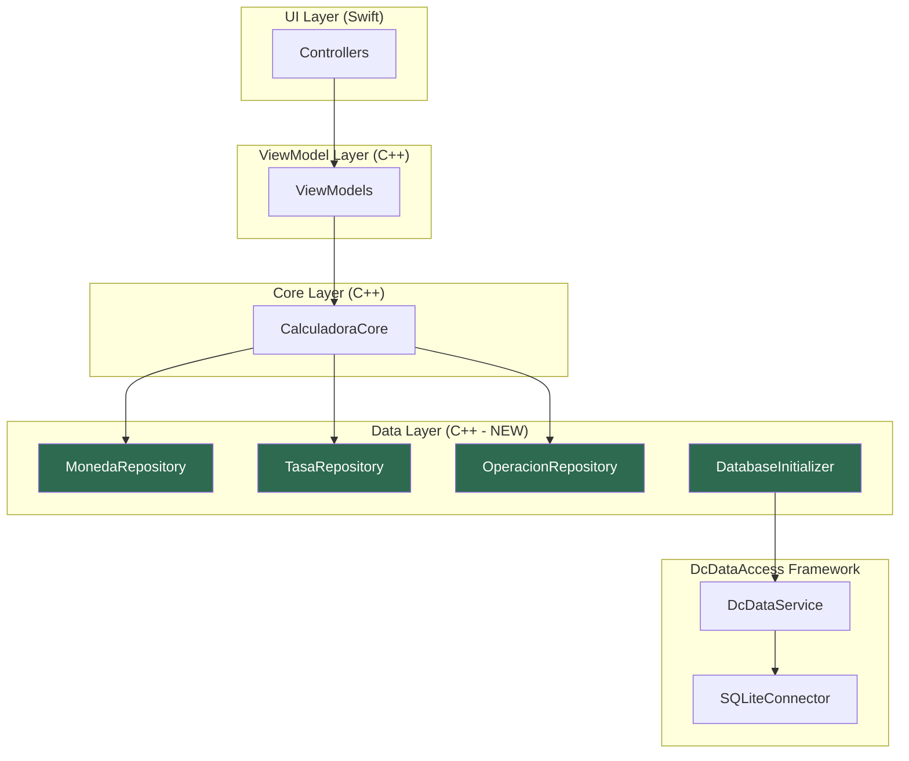
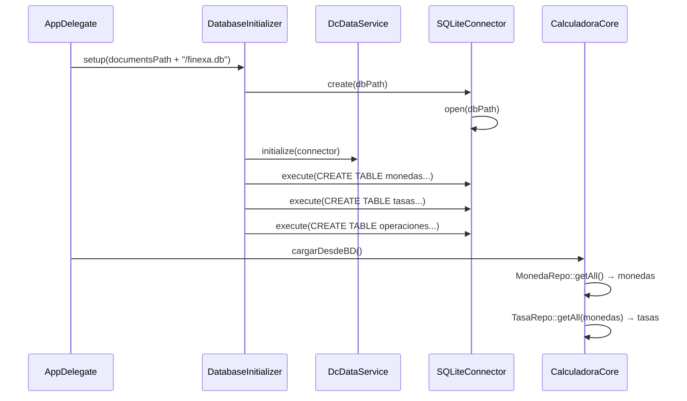

# Persistencia de Datos — Finexa + DcDataAccess (SQLite)

## Contexto

Finexa gestiona tres entidades: **Moneda**, **TasaDeCambio** y **Operacion**. Actualmente todo vive en memoria dentro de [CalculadoraCore](file:///Users/luis_sonoma/Desarrollo/Finexa/Common/Core/include/CalculadoraCore.h#22-48) (vectores). El objetivo es persistir estos datos en una base SQLite usando el framework `DcDataAccess`.

### Infraestructura disponible (DcDataAccess)

| Componente | Descripción |
|---|---|
| [IDcDataConnector](file:///Users/luis_sonoma/Desarrollo/DualComponents/DcDataAccess/Core/IDcDataConnector.hpp#29-59) | Interfaz abstracta: `execute(sql, params)`, `query(sql, params)`, transacciones |
| [SQLiteConnector](file:///Users/luis_sonoma/Desarrollo/DualComponents/DcDataAccess/Platform/SQLite/SQLiteConnector.hpp#17-18) | Implementación concreta con `sqlite3` |
| [DcDataService](file:///Users/luis_sonoma/Desarrollo/DualComponents/DcDataAccess/Core/DcDataService.hpp#7-23) | Singleton global: [initialize(connector)](file:///Users/luis_sonoma/Desarrollo/DualComponents/DcDataAccess/Core/DcDataService.cpp#9-13), [get()](file:///Users/luis_sonoma/Desarrollo/DualComponents/DcDataAccess/Core/DcDataService.cpp#14-20) |
| [SyncableEntity](file:///Users/luis_sonoma/Desarrollo/DualComponents/DcDataAccess/Core/SyncableEntity.hpp#23-41) | Base struct con UUIDv7, `createdAt`, `updatedAt`, `isDeleted`, `syncStatus` |
| `DcValue` | `std::variant<monostate, int64_t, double, string>` |
| `DcRow` / `DcResult` | `map<string, DcValue>` / `vector<DcRow>` |

---

## Esquema de Base de Datos

```sql
-- Monedas
CREATE TABLE IF NOT EXISTS monedas (
    id         TEXT PRIMARY KEY,
    siglas     TEXT NOT NULL UNIQUE,
    nombre     TEXT NOT NULL,
    simbolo    TEXT NOT NULL,
    created_at INTEGER NOT NULL,
    updated_at INTEGER NOT NULL,
    is_deleted INTEGER NOT NULL DEFAULT 0,
    sync_status INTEGER NOT NULL DEFAULT 1
);

-- Tasas de Cambio
CREATE TABLE IF NOT EXISTS tasas (
    id              TEXT PRIMARY KEY,
    moneda_base_id  TEXT NOT NULL,
    moneda_dest_id  TEXT NOT NULL,
    valor           REAL NOT NULL,
    created_at      INTEGER NOT NULL,
    updated_at      INTEGER NOT NULL,
    is_deleted      INTEGER NOT NULL DEFAULT 0,
    sync_status     INTEGER NOT NULL DEFAULT 1,
    UNIQUE(moneda_base_id, moneda_dest_id),
    FOREIGN KEY (moneda_base_id) REFERENCES monedas(id),
    FOREIGN KEY (moneda_dest_id) REFERENCES monedas(id)
);

-- Operaciones
CREATE TABLE IF NOT EXISTS operaciones (
    id              TEXT PRIMARY KEY,
    concepto        TEXT NOT NULL,
    monto_original  REAL NOT NULL,
    moneda_id       TEXT NOT NULL,
    monto_xds       REAL NOT NULL DEFAULT 0.0,
    created_at      INTEGER NOT NULL,
    updated_at      INTEGER NOT NULL,
    is_deleted      INTEGER NOT NULL DEFAULT 0,
    sync_status     INTEGER NOT NULL DEFAULT 1,
    FOREIGN KEY (moneda_id) REFERENCES monedas(id)
);
```

> [!NOTE]
> Todas las tablas heredan la estructura de [SyncableEntity](file:///Users/luis_sonoma/Desarrollo/DualComponents/DcDataAccess/Core/SyncableEntity.hpp#23-41): id (UUIDv7), timestamps, soft-delete y sync status.

---

## Arquitectura de Capas



---

## Archivos Propuestos

### Data Layer (Finexa)

#### [NEW] [DatabaseInitializer.h](file:///Users/luis_sonoma/Desarrollo/Finexa/Common/Data/include/DatabaseInitializer.h)

Responsable de crear las tablas al inicio de la app. Método: `static void setup(const std::string& dbPath)`.

- Crea un [SQLiteConnector](file:///Users/luis_sonoma/Desarrollo/DualComponents/DcDataAccess/Platform/SQLite/SQLiteConnector.hpp#17-18) → lo registra en [DcDataService](file:///Users/luis_sonoma/Desarrollo/DualComponents/DcDataAccess/Core/DcDataService.hpp#7-23)
- Ejecuta los `CREATE TABLE IF NOT EXISTS` del esquema

#### [NEW] [MonedaRepository.h](file:///Users/luis_sonoma/Desarrollo/Finexa/Common/Data/include/MonedaRepository.h)

```cpp
class MonedaRepository {
public:
    static std::vector<std::shared_ptr<Moneda>> getAll();
    static void save(const Moneda& m);         // INSERT or UPDATE (upsert)
    static void remove(const std::string& id); // Soft delete
};
```

#### [NEW] [TasaRepository.h](file:///Users/luis_sonoma/Desarrollo/Finexa/Common/Data/include/TasaRepository.h)

```cpp
class TasaRepository {
public:
    static std::vector<std::shared_ptr<TasaDeCambio>> getAll(
        const std::vector<std::shared_ptr<Moneda>>& monedas);
    static void save(const TasaDeCambio& t);
    static void remove(const std::string& id);
};
```

#### [NEW] [OperacionRepository.h](file:///Users/luis_sonoma/Desarrollo/Finexa/Common/Data/include/OperacionRepository.h)

```cpp
class OperacionRepository {
public:
    static std::vector<std::shared_ptr<Operacion>> getAll(
        const std::vector<std::shared_ptr<Moneda>>& monedas);
    static void save(const Operacion& op);
    static void remove(const std::string& id);
};
```

> [!IMPORTANT]
> [TasaDeCambio](file:///Users/luis_sonoma/Desarrollo/Finexa/Common/Core/include/TasaDeCambio.h#27-28) y [Operacion](file:///Users/luis_sonoma/Desarrollo/Finexa/Common/Core/include/Operacion.h#20-40) referencian [Moneda](file:///Users/luis_sonoma/Desarrollo/Finexa/Common/Core/include/Moneda.h#26-27). Los repositorios reciben la lista de monedas cargada para reconstruir las relaciones en memoria (lookup por siglas/ID).

---

### Cambios a Entidades Existentes

#### [MODIFY] [Moneda.h](file:///Users/luis_sonoma/Desarrollo/Finexa/Common/Core/include/Moneda.h)

Agregar campo `std::string uuid` para mapearlo al [id](file:///Users/luis_sonoma/Desarrollo/Finexa/Common/ViewModels/src/MonedasViewModel.cpp#45-63) de la tabla. El `int id` actual se puede mantener como índice local, pero el UUID será la clave primaria en BD.

#### [MODIFY] [TasaDeCambio.h](file:///Users/luis_sonoma/Desarrollo/Finexa/Common/Core/include/TasaDeCambio.h)

Agregar campo `std::string uuid`.

#### [MODIFY] [Operacion.h](file:///Users/luis_sonoma/Desarrollo/Finexa/Common/Core/include/Operacion.h)

Agregar campo `std::string uuid`.

---

### Inicialización en la App

#### [MODIFY] [AppDelegate.swift](file:///Users/luis_sonoma/Desarrollo/Finexa/iOS/App/AppDelegate.swift)

Llamar a `DatabaseInitializer::setup(dbPath)` antes de crear los ViewModels. La ruta de la BD se obtiene del directorio de documentos de la app.

#### [MODIFY] [CalculadoraCore](file:///Users/luis_sonoma/Desarrollo/Finexa/Common/Core/include/CalculadoraCore.h)

Agregar método `void cargarDesdeBD()` que lea los repositorios y pueble los vectores internos. Agregar método `void guardarMoneda(...)`, `void guardarTasa(...)`, `void guardarOperacion(...)` que deleguen al repositorio.

---

## User Review Required

> [!IMPORTANT]
> **Decisión: UUID vs ID entero**
> Las entidades actuales ([Moneda](file:///Users/luis_sonoma/Desarrollo/Finexa/Common/Core/include/Moneda.h#26-27)) usan `int id`. La propuesta es agregar un `uuid` tipo string (UUIDv7) como clave primaria en BD, manteniendo el `int id` para uso interno. ¿Prefieres reemplazar completamente el `int id` por el UUID, o mantener ambos?

> [!WARNING]
> **Datos semilla (seed data)**
> ¿Las monedas iniciales (VES, USD, XDS, etc.) deben insertarse automáticamente al crear la BD por primera vez, o el usuario las carga manualmente?

---

## Flujo de Inicialización



---

## Verification Plan

### Compilación
- Compilar la librería `FinexaCommonApple` con los nuevos archivos de Data.

### Prueba funcional
1. Ejecutar la app → verificar que se crea `finexa.db` en Documents
2. Agregar monedas → cerrar y reabrir app → verificar que persisten
3. Agregar tasas → cerrar y reabrir app → verificar persistencia
4. Agregar operaciones → verificar persistencia
5. Eliminar registros → verificar soft delete (is_deleted = 1)
